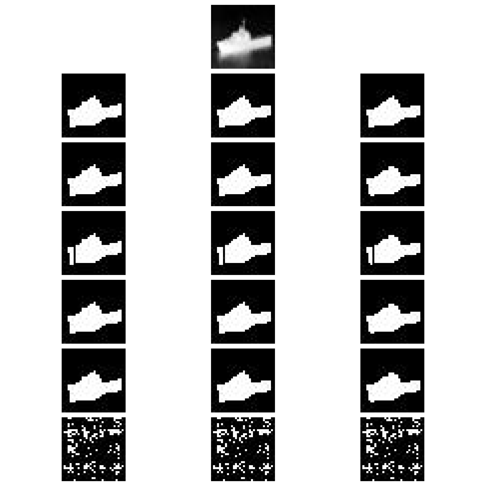

# Iterative Segmentation 
> Learning Level Set Method by Echo State Network for Image Segmentation
============================
### This repos is arranged as follows:
    .
    ├── ...
    ├── bash                   # bash scripts used to move and renames the data files
    ├── matlab                 # Matlab scripts used to generate the data
    ├── src                    # Source files (i.e. files for models, dataloader..etc)
    ├── notebooks              # Notebooks used to generated the resutls for the thesis
    ├── saved_models           # Samples predicted images  
    └── README.md
    └── environment_msc.yml    # Conda Enviroment dependencies

### Introduction

### Notes

## Link to the publication will be added here.

- [MSC Dissertation](https://wiredspace.wits.ac.za/items/2c23f3d9-05fd-410e-ad52-31ecffbbf643/full)
- [Publications](https://scholar.google.com/citations?user=aLjffFkAAAAJ&hl=en)
